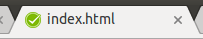

# set-tab-status-icon

A single function that will change the current page's favicon (displayed in the tab bar) to a simple colored status icon, on demand.



## Install

This package is [published on npm](https://www.npmjs.com/package/set-tab-status-icon).

```
> npm install --save set-tab-status-icon
```

Then:

```javascript
import setTabStatusIcon from 'set-tab-status-icon';
setTabStatusIcon('pass');
```

Or you can just include index.js and the `setTabStatusIcon` function will be available on `window`.

## Usage

```javascript
setTabStatusIcon('not-started'); // Gray icon
setTabStatusIcon('in-progress'); // Blue icon
setTabStatusIcon('pass'); // Green icon
setTabStatusIcon('fail'); // Red icon
setTabStatusIcon('#ff00dd'); // Pass any custom color
```

